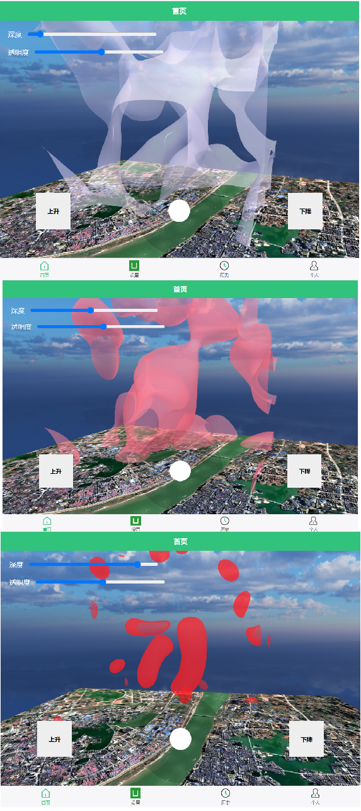

# DroneMarchingCubes
本项目基于Marching cubes算法和Three.js 3d图形库。三维热力图控制台界面可以让用户能够在第一人称视角自由地观察空域中的各类环境指标参数的实际情况，通过三维热力图的方式，可以使用户更加直观清晰地了解到空中的如温度、湿度、噪音、颗粒物粉尘浓度、有害气体浓度等指标在立体空间中的分布情况。除此之外，用户可通过调节“深度”滑动条，动态观察特定环境数据在不同临界值下生成的等值面结构与分布特征。用户还可以通过拖动“透明度”活动条来设置三维形状的透明度。 

The 3D heatmap console interface allows users to freely explore various environmental parameter values within the airspace from a first-person perspective. By visualizing data through 3D heatmaps, users can gain a more intuitive and clear understanding of the spatial distribution of indicators such as temperature, humidity, noise levels, particulate matter concentration, and harmful gas levels in the air. 
In addition, users can dynamically observe the isosurface structures and distribution patterns of specific environmental data under different threshold values by adjusting the “Depth” slider. Users can also set the transparency of the 3D shapes by dragging the “Transparency” slider.

视频链接：https://www.bilibili.com/video/BV1vHdYYAEuV/?vd_source=d1681b7d6b38237df98a7c9aa196d8ce

